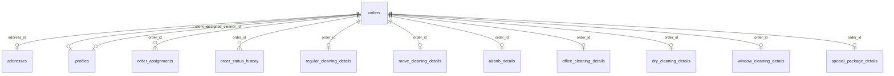

# CatClean — модель данных заказа (Order Model)

Документ описывает **полную целевую структуру заказа** CatClean по **7 типам услуг** (`service_type`) и фиксирует **текущее состояние CRM MVP** (`catclean-crm`).

Связанный документ по жизненному циклу и ролям: [ORDER_RULES.md](./ORDER_RULES.md).

**Код по этому файлу не меняется** — это спецификация для продукта, pricing engine и следующих итераций CRM.

---

## Сводка: 7 типов услуг

| `service_type` | UI label | Detail table (Supabase) |
|----------------|----------|-------------------------|
| `regular_cleaning` | Regular Cleaning | `regular_cleaning_details` |
| `move_in_out` | Move In / Out | `move_cleaning_details` |
| `airbnb_turnover` | Airbnb Turnover | `airbnb_details` |
| `office_cleaning` | Office Cleaning | `office_cleaning_details` |
| `dry_cleaning` | Dry Cleaning | `dry_cleaning_details` |
| `window_cleaning` | Window Cleaning | `window_cleaning_details` |
| `special_pet_package` | Special Pet Package | `special_package_details` |

Маппинг задан в `src/lib/constants/orders.ts` → `ORDER_SERVICE_DETAIL_TABLE`.

---

## Текущее состояние CRM MVP vs целевая модель

| Область | Сейчас в CRM | Целевая модель (этот документ) |
|---------|--------------|-------------------------------|
| `orders` | Расписание, цена, статус, клиент, клинер, `service_type` | + канал, длительность, breakdown цены, admin-поля |
| `addresses` | Город, улица, дом, этаж; **временные хаки** для комментария и домофона | Отдельные поля `doorbell`, `access_notes`, `postal_code` |
| Detail tables | При create заполняются поля detail (sqm, extras) | Полные поля по типу услуги (§2–§8) |
| UI admin create | Форма по `service_type`: m², extras, auto-price | Форма зависит от `service_type` |
| API / mapper | List cards: `serviceSummary` с m²; schedule: `estimated_duration_minutes` | Join detail table в queries + отображение |
| Pricing | **sqm-first** auto (`calculateOrderPrice`) + manual override | Расчёт из полей detail + надбавки |
| Cleaner view | Адрес, время, тип, комментарий (из `postal_code`) | Чек-лист из detail + access |

### Временные маппинги в MVP (важно при миграции)

| Смысл | Где хранится сейчас | Куда перенести |
|-------|---------------------|----------------|
| Комментарий клиента | `addresses.postal_code` | `orders.client_comment` или `addresses.access_notes` |
| Имя на домофоне | `addresses.apartment` | `addresses.doorbell` или `addresses.apartment` (семантика) |
| Internal note (клиент) | `client_profiles.internal_note` | Остаётся на профиле; заказ — `orders.internal_note` |

### sqm-first pricing (CRM MVP, migration 007)

**Правило:** площадь в m² — главный **pricing driver** и основа длительности. Комнаты/ванные — **operational context** для клинера, не база цены для regular cleaning.

| Роль поля | Примеры | Pricing | Cleaner context |
|-----------|---------|---------|-----------------|
| Pricing driver | `property_size_m2`, `office_size_m2`, `property_size_m2` (move), `windows_count` (window service) | Да — база расчёта | Да — ориентир объёма |
| Operational | `rooms_count`, `bathrooms_count`, `bedrooms_count`, `workstations_count` | **Нет** (regular) | Да |
| Extras / surcharge | `oven_cleaning`, `fridge_cleaning`, `inside_cabinets`, `balcony_included`, `has_pets` | Да — фикс. надбавки | Да |

Код: `src/lib/pricing/pricing.constants.ts`, `src/lib/pricing/calculate-order-price.ts`.

**Auto-pricing при create (admin):** `regular_cleaning`, `move_in_out`, `office_cleaning`. Остальные типы — ручной `estimated_price`.

**Сохранение:** `orders.estimated_price`, `orders.price_breakdown` (jsonb, incl. `autoPrice`), `orders.estimated_duration_minutes`.

---

## 1. Общие поля заказа (Common)

### 1.1 Таблица `orders`

**Идентичность и связи**

| Поле | Тип | Обязательное | Описание |
|------|-----|--------------|----------|
| `id` | bigint / uuid | да | PK заказа |
| `order_number` | text | нет | Человекочитаемый номер (для UI, счетов) |
| `client_id` | uuid | да | FK → `profiles.id` (`role = client`) |
| `address_id` | uuid | да | FK → `addresses.id` |
| `created_by` | uuid | нет | Кто создал (staff / system) |
| `assigned_cleaner_id` | uuid | нет | FK → `profiles.id` клинера |

**Услуга и расписание**

| Поле | Тип | Обязательное | Описание |
|------|-----|--------------|----------|
| `service_type` | enum / text | да | Одно из 7 значений § «Сводка» |
| `scheduled_date` | date | да | Дата начала уборки |
| `scheduled_time` | time | да | Время начала (`scheduled_start` для §7 ORDER_RULES) |
| `estimated_duration_hours` | numeric | нет | Плановая длительность (часы; целевое) |
| `estimated_duration_minutes` | integer | нет | **CRM:** плановая длительность в минутах (schedule, из pricing engine) |
| `actual_duration_hours` | numeric | нет | Факт (после `completed`) |

**Статусы и оплата** (см. [ORDER_RULES.md](./ORDER_RULES.md))

| Поле | Тип | Описание |
|------|-----|----------|
| `status` | enum | Жизненный цикл заказа |
| `payment_status` | enum | `unpaid` \| `paid` \| `card_hold` |
| `payment_method` | enum | `cash` \| `card` \| `invoice` (целевое) |
| `currency` | text | По умолчанию `EUR` |

**Ценообразование (общий уровень заказа)**

| Поле | Тип | Описание |
|------|-----|----------|
| `estimated_price` | numeric | Итог для клиента (сейчас вводится вручную в MVP) |
| `price_breakdown` | jsonb | Целевое: строки расчёта (base, addons, discount, fee) |
| `discount_percent` | numeric | Скидка на заказ |
| `cancellation_fee_amount` | numeric | После отмены клиентом (см. ORDER_RULES §7) |

**Канал и коммуникация**

| Поле | Тип | Описание |
|------|-----|----------|
| `channel` | enum | `website` \| `phone` \| `partner` \| `manual` |
| `client_comment` | text | Пожелания клиента (видны клинеру) |
| `internal_note` | text | **Admin-only** — заметка по заказу |
| `margin_amount` | numeric | **Admin-only** — маржа / внутренняя экономика |
| `manual_price_adjustment` | numeric | **Admin-only** — ручная корректировка итога |
| `manual_adjustment_reason` | text | **Admin-only** — причина корректировки |

**Служебные**

| Поле | Тип | Описание |
|------|-----|----------|
| `created_at` | timestamptz | |
| `updated_at` | timestamptz | |

**Сейчас используется в CRM:** `id`, `order_number`, `client_id`, `address_id`, `created_by`, `assigned_cleaner_id`, `status`, `scheduled_date`, `scheduled_time`, `service_type`, `currency`, `payment_status`, `estimated_price`, `created_at`, `updated_at`.

---

### 1.2 Таблица `addresses`

Один заказ → один адрес объекта уборки (повторное использование адресов клиентом — отдельная итерация).

| Поле | Тип | Обязательное | Описание |
|------|-----|--------------|----------|
| `id` | uuid | да | PK |
| `city` | text | да | Город |
| `street` | text | да | Улица |
| `house_number` | text | да | Номер дома |
| `floor` | text | нет | Этаж |
| `apartment` | text | нет | Квартира / офис (номер помещения) |
| `doorbell` | text | нет | Имя на домофоне |
| `postal_code` | text | нет | Индекс (не путать с комментарием) |
| `access_notes` | text | нет | Код подъезда, парковка, вход со двора |
| `latitude` | numeric | нет | Для маршрута (будущее) |
| `longitude` | numeric | нет | |

**Сейчас в CRM:** `city`, `street`, `house_number`, `floor`; `apartment` ← doorbell; `postal_code` ← customer comment.

---

### 1.3 Detail tables (паттерн)

Для каждого `service_type` — **ровно одна** строка в соответствующей detail-таблице на заказ.

| Общее поле | Тип | Описание |
|------------|-----|----------|
| `id` | uuid | PK |
| `order_id` | bigint/uuid | FK → `orders.id`, unique |
| `created_at` | timestamptz | |
| `updated_at` | timestamptz | |

+ поля специфики услуги (§2–§8).

**Сейчас в CRM:** insert только `{ order_id }` без бизнес-полей.

---

### 1.4 Связанные сущности (не detail)

| Таблица | Назначение |
|---------|------------|
| `order_assignments` | Назначение клинера (`cleaner_id` = `profiles.id`), статус assignment, `completed_at` |
| `order_status_history` | Аудит смены `orders.status` + client requests (reschedule) |
| `client_profiles` | `client_type`, `company_name`, `internal_note` (профиль клиента, не заказ) |
| `profiles` | Клиент / клинер / staff |

---

## 2. Regular cleaning (`regular_cleaning_details`)

Стандартная уборка квартиры / дома.

### 2.0 Площадь и интенсивность (pricing drivers)

| Поле | Тип | Pricing | Cleaner | Описание |
|------|-----|---------|---------|----------|
| `property_size_m2` | int | **да (база)** | да | Площадь m² — главное поле для цены и duration |
| `cleaning_intensity` | text | да | да | `standard` \| `deep` (множитель базы) |

### 2.1 Помещения (operational context)

| Поле | Тип | Pricing | Cleaner | Описание |
|------|-----|---------|---------|----------|
| `rooms_count` | int | нет | да | Общее число комнат (агрегат) |
| `bathrooms_count` | int | нет | да | Ванные / WC |
| `bedrooms_count` | int | да | да | Спальни |
| `kitchen_included` | bool | да | да | Уборка кухни |
| `living_room_included` | bool | да | да | Гостиная |
| `corridor_included` | bool | нет | да | Коридор / прихожая |
| `balcony_included` | bool | да | да | Балкон / лоджия |

### 2.2 Доп. зоны и техника

| Поле | Тип | Pricing | Cleaner | Описание |
|------|-----|---------|---------|----------|
| `oven_cleaning` | bool | да | да | Чистка духовки |
| `fridge_cleaning` | bool | да | да | Холодильник (внутри) |
| `cabinets_cleaning` | bool | да | да | Шкафы (внутри / фасады — уточнить в прайсе) |
| `windows_included` | bool | да | да | Лёгкая мойка окон в рамках regular (не full window service) |

### 2.3 Условия на объекте

| Поле | Тип | Pricing | Cleaner | Описание |
|------|-----|---------|---------|----------|
| `has_pets` | bool | да | да | Животные на объекте |
| `pet_types` | text | нет | да | Собака / кошка / другое |
| `extra_hours` | numeric | да | да | Доп. часы сверх базового пакета |
| `supplies_provided_by_client` | bool | нет | да | Клиент даёт средства |
| `heavy_dirt_level` | enum | да | да | `light` \| `normal` \| `heavy` (целевое) |

---

## 3. Move in / out (`move_cleaning_details`)

Генеральная / выездная / въездная уборка.

| Поле | Тип | Pricing | Cleaner | Описание |
|------|-----|---------|---------|----------|
| `property_size_m2` | int | **да (база)** | да | Площадь m² (`property_size_sqm` — legacy alias в docs) |
| `package_type` | enum | да | да | `standard` \| `premium` |
| `move_type` | enum | да | да | `move_in` \| `move_out` \| `both` |
| `empty_apartment` | bool | да | да | Пустая квартира (без мебели) |
| `heavy_dirt` | bool | да | да | Сильное загрязнение |
| `limescale_removal` | bool | да | да | Известковый налёт, сантехника |
| `oven_cleaning` | bool | да | да | |
| `fridge_cleaning` | bool | да | да | |
| `cabinets_cleaning` | bool | да | да | |
| `windows_included` | bool | да | да | |
| `balcony_included` | bool | да | да | |
| `bathrooms_count` | int | да | да | |
| `kitchen_deep_clean` | bool | да | да | Приоритет кухни (из seed-комментариев) |
| `extra_hours` | numeric | да | да | |

---

## 4. Airbnb turnover (`airbnb_details`)

Подготовка апартаментов между гостями.

| Поле | Тип | Pricing | Cleaner | Описание |
|------|-----|---------|---------|----------|
| `linen_change` | bool | да | да | Смена постельного белья |
| `towels_change` | bool | да | да | Полотенца |
| `laundry_required` | bool | да | да | Стирка на объекте / вынос |
| `consumables_restock` | bool | да | да | Шампунь, туалетная бумага, чай/кофе |
| `photo_report_required` | bool | нет | да | Фотоотчёт после уборки |
| `check_in_time` | time | да | да | Время заезда следующих гостей |
| `check_out_time` | time | нет | да | Время выезда предыдущих |
| `keys_handover_notes` | text | нет | да | Ключи, lockbox, код |
| `property_size_sqm` | numeric | да | нет | Для расчёта базы |
| `bedrooms_count` | int | да | да | |
| `bathrooms_count` | int | да | да | |

---

## 5. Office cleaning (`office_cleaning_details`)

Коммерческий объект.

| Поле | Тип | Pricing | Cleaner | Описание |
|------|-----|---------|---------|----------|
| `office_size_sqm` | numeric | да | да | Площадь офиса |
| `workstations_count` | int | да | да | Рабочие места |
| `meeting_rooms_count` | int | да | да | Переговорные |
| `bathrooms_count` | int | да | да | Санузлы |
| `kitchen_area_included` | bool | да | да | Кухня / зона отдыха |
| `frequency` | enum | да | нет | `one_time` \| `weekly` \| `biweekly` \| `monthly` |
| `after_hours` | bool | да | да | Уборка вне рабочего времени (надбавка) |
| `reception_access_code` | text | нет | да | Код / ресепшн (дубль с access_notes) |
| `waste_disposal_required` | bool | да | да | Вынос мусора |

---

## 6. Dry cleaning (`dry_cleaning_details`)

Химчистка мебели / текстиля на объекте (не путать с `cleaner_profiles.accepts_dry_cleaning` — навык клинера).

| Поле | Тип | Pricing | Cleaner | Описание |
|------|-----|---------|---------|----------|
| `sofas_count` | int | да | да | Диваны |
| `sofa_type` | text | нет | да | Угловой, двухместный… |
| `mattresses_count` | int | да | да | Матрасы |
| `mattress_size` | enum | нет | да | `single` \| `double` \| `king` |
| `carpets_count` | int | да | да | Ковры |
| `carpet_area_sqm` | numeric | да | нет | Площадь ковров |
| `chairs_count` | int | да | да | Стулья / кресла |
| `material_notes` | text | нет | да | Ткань, деликатные материалы |
| `stains_description` | text | нет | да | Пятна, локации |
| `pet_stains` | bool | да | да | Пятна от животных |
| `dry_cleaning_method` | enum | нет | да | `steam` \| `foam` \| `extract` (целевое) |

---

## 7. Window cleaning (`window_cleaning_details`)

Мойка окон (отдельная услуга).

| Поле | Тип | Pricing | Cleaner | Описание |
|------|-----|---------|---------|----------|
| `windows_count` | int | да | да | Количество оконных створок / блоков |
| `sashes_count` | int | да | да | Створки (если считается отдельно) |
| `balcony_doors_count` | int | да | да | Балконные двери |
| `outside_access` | bool | да | да | Доступ снаружи (фасад) |
| `ladder_required` | bool | да | да | Нужна лестница / вышка |
| `floor_level` | int | нет | да | Этаж (риск / время) |
| `high_rise` | bool | да | да | Выше N этажа — надбавка / отказ |
| `interior_only` | bool | да | да | Только внутри |

---

## 8. Special pet package (`special_package_details`)

Усиленный пакет для домов с животными (может наследовать поля regular + акцент на pets).

| Поле | Тип | Pricing | Cleaner | Описание |
|------|-----|---------|---------|----------|
| `has_pets` | bool | да | да | Всегда true для типа |
| `pet_types` | text | нет | да | |
| `pet_count` | int | да | нет | |
| `hair_removal_level` | enum | да | да | `light` \| `heavy` |
| `odor_treatment` | bool | да | да | Устранение запаха |
| `furniture_protection` | bool | нет | да | Чехлы / зоны |
| `inherits_regular_fields` | bool | — | — | Флаг: дублировать §2 или FK на regular snapshot |

Рекомендация: в БД либо отдельные колонки, либо `regular_cleaning_details` + строка `special_package_details` только для надбавок.

---

## 9. Поля, влияющие на цену (Pricing-relevant)

### 9.1 Общие (уровень `orders` + `addresses`)

| Источник | Поля |
|----------|------|
| `orders` | `service_type`, `scheduled_date`, `scheduled_time`, `estimated_duration_hours`, `discount_percent`, `manual_price_adjustment`, `channel` (промо) |
| `addresses` | `city` (зональный тариф), опционально `property_size` если вынесен на address |

### 9.2 По типам услуги (detail)

| service_type | Ключевые драйверы цены |
|--------------|------------------------|
| `regular_cleaning` | `rooms_count`, `bathrooms_count`, `bedrooms_count`, add-ons (oven, fridge, cabinets, windows, balcony), `has_pets`, `extra_hours`, `heavy_dirt_level` |
| `move_in_out` | `property_size_sqm`, `package_type` (standard/premium), `move_type`, `empty_apartment`, `heavy_dirt`, `limescale_removal`, все add-ons, `extra_hours` |
| `airbnb_turnover` | `property_size_sqm`, `bedrooms_count`, `bathrooms_count`, linen/towels/laundry/consumables, срочность (`check_in_time` − scheduled) |
| `office_cleaning` | `office_size_sqm`, `workstations_count`, `meeting_rooms_count`, `bathrooms_count`, `kitchen_area_included`, `frequency`, `after_hours` |
| `dry_cleaning` | Количество единиц (sofas, mattresses, carpets, chairs), `carpet_area_sqm`, `pet_stains`, сложность (`material_notes`) |
| `window_cleaning` | `windows_count`, `sashes_count`, `balcony_doors_count`, `outside_access`, `ladder_required`, `high_rise` |
| `special_pet_package` | База regular + `hair_removal_level`, `odor_treatment`, `pet_count` |

### 9.3 MVP CRM (сейчас)

Цена = **ручной** `orders.estimated_price`. Поля detail **не участвуют** в расчёте.

### 9.4 Целевой pipeline расчёта

```
base = tariff(service_type, city, size/rooms)
addons = sum(unit_price × quantity)  // bool → 0/1
urgency = f(scheduled_start - now)
discount = orders.discount_percent
subtotal = base + addons + urgency
total = subtotal - discount + orders.manual_price_adjustment
orders.estimated_price = round(total)
orders.price_breakdown = { lines: [...] }
orders.margin_amount = total - cleaner_cost_estimate  // admin
```

---

## 10. Поля для клинера (Cleaner-relevant)

Клинер видит **только назначенные** заказы (`assigned_cleaner_id = profiles.id`). До выезда ему нужны операционные данные, не финансы.

### 10.1 Всегда (из `orders` + `addresses` + `profiles`)

| Поле | Источник |
|------|----------|
| Дата / время | `scheduled_date`, `scheduled_time` |
| Тип услуги | `service_type` (label) |
| Адрес (строка) | `city`, `street`, `house_number`, `floor`, `apartment` |
| Доступ | `doorbell`, `access_notes` |
| Комментарий клиента | `client_comment` (не internal) |
| Контакт клиента | `profiles.phone` (политика: маскирование — будущее) |
| Статус | `status`, `canStart` / `canComplete` (логика ORDER_RULES) |

### 10.2 Из detail (чек-лист работ)

| service_type | Что показать клинеру |
|--------------|----------------------|
| `regular_cleaning` | Комнаты, bathroom/bedroom count, oven/fridge/cabinets/windows/balcony, pets, extra_hours |
| `move_in_out` | m², package, move_in/out, empty, heavy dirt, limescale, add-ons |
| `airbnb_turnover` | Linen, towels, laundry, consumables, photo_report, check-in time, keys |
| `office_cleaning` | m², workstations, meeting rooms, bathrooms, kitchen, after_hours |
| `dry_cleaning` | Список предметов, stains, pet_stains, material_notes |
| `window_cleaning` | windows/sashes/balcony doors, outside_access, ladder_required |
| `special_pet_package` | Pet info + наследуемый regular checklist |

### 10.3 Не показывать клинеру

- `internal_note`, `margin_amount`, `manual_price_adjustment`, `price_breakdown`
- `client_profiles.internal_note` (профиль)
- Детали оплаты кроме «оплачено / не оплачено» (опционально)

### 10.4 Сейчас в CRM

Cleaner API: адрес, время, `serviceTypeLabel`, `estimatedPrice` (цена видна — при желании скрыть), `customerComment` из `addresses.postal_code`, doorbell из `apartment`. Detail tables **не подгружаются**.

---

## 11. Поля только для admin (Admin-only)

| Поле | Где хранить | Назначение |
|------|-------------|------------|
| `orders.internal_note` | `orders` | Заметка оператора по заказу |
| `orders.margin_amount` | `orders` | Маржа / себестоимость vs цена клиента |
| `orders.manual_price_adjustment` | `orders` | Ручная корректировка итога (+/−) |
| `orders.manual_adjustment_reason` | `orders` | Обоснование корректировки |
| `orders.price_breakdown` | `orders` (jsonb) | Строки калькуляции |
| `orders.created_by` | `orders` | Аудит |
| `client_profiles.internal_note` | `client_profiles` | Долгосрочная заметка о клиенте (не про один заказ) |
| `order_status_history.comment` | history | Reschedule requests, assign notes |
| Полный `payment_status` + refund workflow | `orders` | См. ORDER_RULES §9 |

Admin UI (целевое): блок «Finance & internal» на detail заказа, недоступен client/cleaner API.

**Сейчас в CRM:** `estimated_price` редактируется при создании; `internal_note` на клиенте есть в Admin Clients; на заказе admin-only полей **нет**.

---

## 12. ER-диаграмма (логическая)



---

## 13. Чеклист внедрения (для разработки, не MVP)

1. Миграции: колонки `orders` / `addresses` + поля в 7 detail tables.
2. Перенос данных: `postal_code` → `client_comment`, `apartment` → `doorbell`.
3. Расширить `ADMIN_ORDER_SELECT` / cleaner / client selects join на detail по `service_type`.
4. Формы: wizard по `service_type` + pricing preview.
5. Обновить seed `scripts/seed-example-orders.ts` реалистичными detail.
6. Синхронизировать [ORDER_RULES.md](./ORDER_RULES.md) при изменении полей, влияющих на cancel/reschedule.

---

*Версия: CatClean Order Model v1. Дата: 2026-05-21. Основано на коде `catclean-crm` (constants, mappers, createOrderAction) и продуктовых требованиях.*
