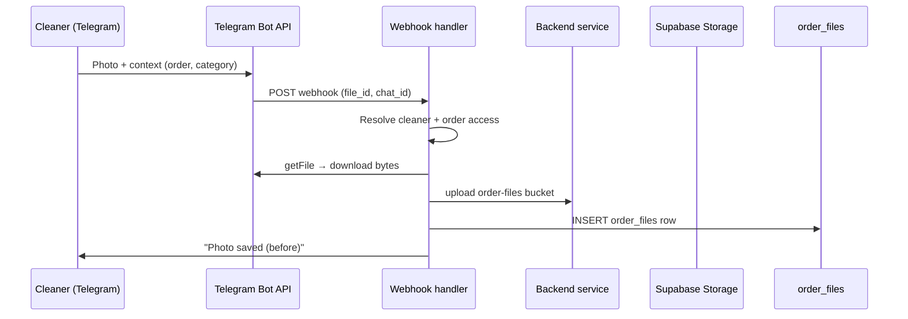

# CatClean — план Telegram-бота для клинеров

Документ фиксирует **продуктовое и техническое направление**: операционные действия клинера (фото, start/complete, проблемы) в перспективе удобнее делать через **Telegram bot**, а не через веб-CRM.

**Код по этому файлу сейчас не меняется** — это только план. Реализация бота, webhook и привязки аккаунтов — отдельная итерация.

Связанные документы:

- [API_MAP.md](./API_MAP.md) — текущие REST endpoints
- [ORDER_RULES.md](./ORDER_RULES.md) — статусы и переходы заказа
- [ORDER_MODEL.md](./ORDER_MODEL.md) — модель заказа

---

## 1. Почему Telegram bot для клинеров лучше веб-сайта

| Критерий | Веб `/app/cleaner` | Telegram bot |
|----------|-------------------|--------------|
| Скорость | Логин, навигация, формы | Открыть чат → кнопка / команда |
| Доступ с телефона | Браузер, сессия, мелкий UI | Нативная камера и галерея |
| Загрузка фото | `multipart` через браузер | Отправить фото в чат одним жестом |
| Start / Complete / Problem | Отдельная страница заказа | Inline-кнопки в контексте заказа |
| Уведомления | Push/email (если настроены) | Сообщения в Telegram «из коробки» |

**Вывод для продукта:**

- Клинер работает **в поле**, чаще с телефона и без желания «заходить на сайт».
- Фото **before / after / damage** логично приходят из мессенджера, а не из веб-формы.
- Подтверждения **Start cleaning**, **Complete cleaning**, **Report problem** — короткие действия в один тап.

Веб-кабинет клинера остаётся запасным/админским каналом; **основной операционный UX для клинера — Telegram**.

---

## 2. Что бот должен уметь (MVP функций)

### Список заказов

- Показать **назначенные заказы на сегодня** (`assigned_cleaner_id = cleaner`, дата = today).
- Краткая карточка: `#displayId`, время, адрес (строка), статус.

### Детали заказа

- По выбору заказа — полные детали для выезда:
  - адрес, этаж, домофон, комментарий клиента;
  - тип услуги, окно времени;
  - текущий статус и доступные действия.

### Действия по заказу

| Действие | Поведение | Связь с CRM |
|----------|-----------|-------------|
| **Start cleaning** | Кнопка → подтверждение | `PATCH` аналог `/api/cleaner/orders/[id]/start` |
| **Complete cleaning** | Кнопка → подтверждение | `PATCH` аналог `/api/cleaner/orders/[id]/complete` |
| **Upload before_photo** | «Отправьте фото» → приём файла | `order_files.category = before_photo` |
| **Upload after_photo** | То же | `category = after_photo` |
| **Upload damage_photo** | То же | `category = damage_photo` |
| **Report problem** | Статус/флаг + опционально фото | История / note (см. ORDER_RULES) |
| **Комментарий админу** | Текстовое сообщение | `order_status_history` как note или отдельный канал |

Категория фото **не угадывается** из EXIF — задаётся **кнопкой или командой** до/после отправки файла (см. §4).

---

## 3. Привязка Telegram user ↔ cleaner profile

### Целевая схема данных

Позже в `cleaner_profiles` (или рядом):

```text
telegram_chat_id  bigint | text  UNIQUE NULL  -- chat id из Bot API
telegram_username text NULL
linked_at         timestamptz NULL
```

- `profiles.id` по-прежнему = `auth.users.id` = `orders.assigned_cleaner_id`.
- Бот идентифицирует клинера по **`telegram_chat_id`**, внутри backend резолвит в `profiles.id`.

### Способы привязки

1. **Вручную (admin)**  
   Админ в CRM указывает `@username` или вставляет `chat_id` после первого контакта с ботом → `POST /api/admin/cleaners/[id]/telegram-link`.

2. **Link flow (cleaner)**  
   - В CRM или email клинеру выдаётся одноразовая ссылка: `https://t.me/CatCleanBot?start=link_<token>`.  
   - Токен в БД: `cleaner_telegram_link_tokens` (profile_id, expires_at, used_at).  
   - `/start link_<token>` в боте → webhook валидирует токен → пишет `telegram_chat_id` в `cleaner_profiles`.

3. **Запрос кода (опционально)**  
   Клинер вводит в боте короткий код из личного кабинета — альтернатива deep link.

**Без привязки** бот не показывает заказы и не принимает фото (только «Привяжите аккаунт»).

---

## 4. Как фото попадают в систему



### Шаги

1. Клинер выбирает заказ и нажимает, например, **«Before photo»**.
2. Бот переводит диалог в режим ожидания фото для `(order_id, category)`.
3. Telegram присылает `message.photo` → webhook.
4. Backend:
   - проверяет `telegram_chat_id` → `profiles.id`;
   - проверяет `orders.assigned_cleaner_id === profiles.id`;
   - скачивает файл через Bot API (`getFile` + HTTPS);
   - валидирует MIME (jpeg/png/webp) и размер (≤10MB);
   - загружает в bucket **`order-files`**:
     - путь: `orders/{orderId}/telegram/{timestamp}-{filename}` (или `.../cleaner/...` — единый префикс зафиксировать при реализации);
   - создаёт строку в **`order_files`**:
     - `order_id`, `uploaded_by`, `file_path`, `file_name`, `file_type`, `file_size`, `category`.

### Категории для бота

| Кнопка / команда | `order_files.category` |
|------------------|------------------------|
| Before photo | `before_photo` |
| After photo | `after_photo` |
| Damage photo | `damage_photo` |
| (опционально) Other | `other` |

Категория **`document`** для бота не используется (только staff/admin в CRM).

---

## 5. Endpoints и сервисы (будущая реализация)

### Публичные / integration

| Method | Path | Назначение |
|--------|------|------------|
| POST | `/api/integrations/telegram/webhook` | Приём updates от Telegram (сообщения, callback_query, фото) |

Защита webhook: secret token в URL или заголовок `X-Telegram-Bot-Api-Secret-Token`.

### Admin

| Method | Path | Назначение |
|--------|------|------------|
| POST | `/api/admin/cleaners/[id]/telegram-link` | Привязать / отвязать `telegram_chat_id` |
| GET | (опционально) | Статус привязки, username |

### Cleaner (можно переиспользовать или упростить для бота)

| Method | Path | Назначение |
|--------|------|------------|
| GET | `/api/cleaner/orders/today` | Список заказов клинера на сегодня (для бота и при необходимости веба) |

Существующие endpoints остаются источником правды для статусов:

- `GET /api/cleaner/orders/[id]`
- `PATCH /api/cleaner/orders/[id]/start`
- `PATCH /api/cleaner/orders/[id]/complete`

Бот вызывает те же server mutations, что и REST routes (не дублировать бизнес-логику в handler webhook).

### Internal (не HTTP для клиента)

```text
uploadOrderFileFromTelegram({
  orderId,
  cleanerProfileId,
  fileBytes,
  mimeType,
  fileName,
  category,
  source: "telegram",
})
```

- Общая логика с `uploadCleanerOrderFile` / `uploadAdminOrderFile`: Storage + `order_files` insert + signed URL при необходимости ответа в чат.
- Webhook только оркестрирует: auth по chat_id → вызов service.

---

## 6. Что НЕ делаем сейчас

| Не делаем | Комментарий |
|-----------|-------------|
| Реализацию бота | Нет репозитория бота, webhook, деплоя |
| Расширение веб-загрузки фото клинером | Продуктовый приоритет — Telegram; веб не развиваем как основной канал |
| Показ фото клиенту | Client portal без галереи `order_files` |
| `telegram_chat_id` в БД | Миграция — когда начнётся интеграция |
| Новые integration routes | Только описание в этом плане |

**Делаем сейчас:** CRM, admin files, storage, `order_files`, правила заказов — чтобы бот подключился без переделки ядра.

---

## 7. Связь с текущей CRM (уже есть)

Инфраструктура для файлов **готова** — Telegram-бот станет ещё одним клиентом того же backend:

| Компонент | Статус |
|-----------|--------|
| Supabase Storage bucket **`order-files`** (private) | Есть |
| Таблица **`order_files`** + категории | Миграция `003_order_files.sql` |
| Signed URLs (service role, ~1h TTL) | `order-file-signed-url.ts` |
| Admin: list / upload / delete | `GET|POST /api/admin/orders/[id]/files`, `DELETE .../files/[fileId]` |
| UI admin **Files & Photos** | `AdminOrderFilesCard` |
| Server: list + upload + delete mutations | `listOrderFilesWithSignedUrls`, `uploadAdminOrderFile`, … |
| Правило назначения | `orders.assigned_cleaner_id` = `profiles.id` клинера |

### Что бот переиспользует без изменения модели

- Тот же bucket и таблица `order_files`.
- Те же категории `before_photo`, `after_photo`, `damage_photo`, `other`.
- Те же проверки «заказ принадлежит клинеру» (`fetchCleanerOwnedOrder`).
- Admin продолжает видеть **все** файлы заказа (включая загруженные из Telegram).

### Что появится при реализации бота

- Поле `cleaner_profiles.telegram_chat_id` (+ link tokens).
- Webhook route и Telegram Bot API client.
- `uploadOrderFileFromTelegram` (или обобщение существующего upload).
- UX в Telegram (меню, FSM для «жду фото», callback-кнопки).

---

## Рекомендуемый порядок работ (когда начнём)

1. Миграция `telegram_chat_id` + admin link API.  
2. Webhook + привязка аккаунта (link flow).  
3. «Заказы на сегодня» + карточка заказа.  
4. Start / Complete через inline-кнопки.  
5. Загрузка фото по категориям.  
6. Report problem + комментарий админу.  
7. Мониторинг, rate limits, логирование webhook.

---

*Документ создан для фиксации решения: **операционный канал клинера — Telegram**, CRM и Storage — единый backend для файлов и статусов.*
